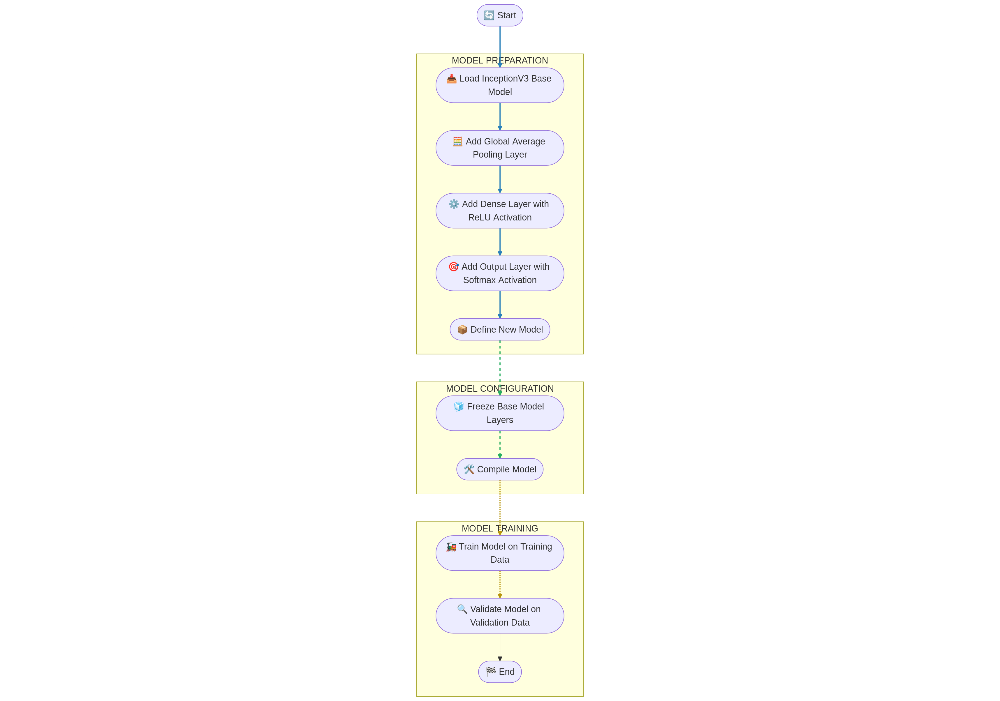
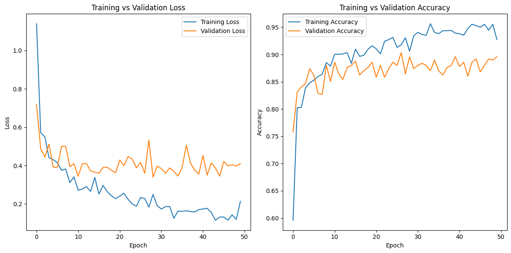
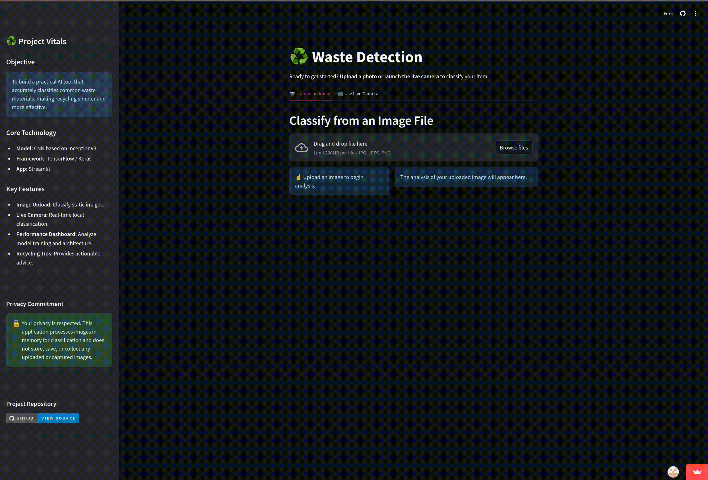

# ♻️ AI-Based-Waste-Detection

**A project for the "Practical Application of Artificial Intelligence" course.**

This repository contains the code for an interactive web application that uses a deep learning model to classify waste
into six categories. The application is built with Streamlit and TensorFlow/Keras, featuring both file-based and live
camera classification capabilities.

<p align="center">
  <a href="https://ai-based-waste-detection.streamlit.app/">
    
  </a>
</p>

---

## 📋 Table of Contents

1. [Project Overview](#-project-overview)
2. [Key Features](#-key-features)
3. [Technology Stack](#-technology-stack)
4. [Model Architecture & Training](#-model-architecture--training)
5. [Performance Evaluation](#-performance-evaluation)
6. [Local Setup & Installation](#-local-setup--installation)
7. [How to Use the Application](#-how-to-use-the-application)
8. [Future Work & Advanced Extensions](#-future-work--advanced-extensions)

---

## 🎯 Project Overview

In an effort to address environmental challenges, accurate waste sorting is crucial for effective recycling programs.
This project tackles this problem by developing a practical, user-friendly tool that provides instant waste
classification. By leveraging a powerful Convolutional Neural Network (CNN), the application helps educate users and
reduce recycling contamination.

---

## ✨ Key Features

- **Dual-Mode Classification:** Analyze waste via direct image upload or a real-time local webcam feed.
- **Interactive UI:** A polished interface built with Streamlit, featuring a dynamic sidebar, organized tabs, and clear
  user guidance.
- **Rich Feedback:** Provides predictions with a confidence meter, a full probability distribution chart, and
  context-aware recycling tips.
- **Intelligent Analysis:**
    - Handles uncertain predictions gracefully with a confidence threshold.
    - Uses a "Region of Interest" (ROI) guide for better camera-based analysis.

---

## 🛠️ Technology Stack

- **Backend:** Python
- **AI/ML Framework:** TensorFlow, Keras
- **Web Framework:** Streamlit, Streamlit-WebRTC
- **Data Processing:** NumPy, Pandas
- **Image Handling:** Pillow, OpenCV
- **Plotting:** Matplotlib, Seaborn (for evaluation scripts)
- **Notebook Environment:** Jupyter / Google Colab

---

## 🧠 Model Architecture & Training

The model employs a **transfer learning** approach, which leverages the power of a large, pre-trained network and
fine-tunes it for our specific waste classification task. This method allows for high accuracy without the need for an
enormous dataset or training from scratch.

The architecture consists of two main parts:

1. **Base Model:** The powerful **InceptionV3** architecture, pre-trained on the ImageNet dataset, is used as the
   convolutional base. Its role is to act as a sophisticated feature extractor, identifying low-level features like
   edges, textures, and shapes from the input image. The original top classification layers of InceptionV3 are removed.

2. **Custom Classification Head:** The following custom layers were added on top of the InceptionV3 base to interpret
   the extracted features and make the final classification:
    - A `GlobalAveragePooling2D` layer to flatten the features from the base model into a vector.
    - A fully connected `Dense` layer with 1024 neurons and a `ReLU` activation function.
    - A `Dropout` layer with a rate of 0.2 (20%) to prevent overfitting.
    - A final `Dense` output layer with 6 neurons (one for each class) and a `softmax` activation function to produce
      the final class probabilities.

#### Training Parameters

- **Optimizer:** Adam
- **Loss Function:** Categorical Cross-entropy
- **(Epochs: 50, Batch Size: 32)** *(As specified in your README)*

#### Visual Diagram

The diagram below illustrates this.

<p align="center">
  
</p>

---

## 📊 Performance Evaluation

The model's performance was evaluated on a held-out test set of images it had never seen during training.

- **Final Test Accuracy:** **89.56%**

#### Training History

<p align="center">
  
</p>

---

## 🚀 Local Setup & Installation

To run this application on your local machine, please follow these steps.

1. **Prerequisites:**
    - Python 3.12
    - `git` for cloning the repository.

2. **Clone the Repository:**
   ```bash
   git clone [https://github.com/bkljuno1/AI-Based-Waste-Detection.git](https://github.com/bkljuno1/AI-Based-Waste-Detection.git)
   cd AI-Based-Waste-Detection
   ```

3. **Create a Virtual Environment:**
   It is highly recommended to use a virtual environment.
   ```bash
   python3 -m venv .venv
   source .venv/bin/activate  # On macOS/Linux
   # .venv\Scripts\activate  # On Windows
   ```

4. **Install Dependencies:**
   A `requirements.txt` file is included with all necessary packages.
   ```bash
   pip install -r requirements.txt
   ```

---

## Usage

Once the setup is complete, you can run the main application or the evaluation script.

#### Running the Streamlit App

```bash
streamlit run app.py
```

## 🚀 How to Use the Application

This application provides two primary modes for waste classification, each demonstrated below.

### 1. Classify by Image Upload

This is the most reliable method and works on all platforms. Simply upload an image, and the AI will analyze it and
provide a classification, confidence score, and a helpful recycling tip.

<p align="center">
  
</p>

#### Workflow Steps:

1. **Upload an Image:** Use the file browser in the first tab to select a `.jpg` or `.png` file.
2. **View Results:** The AI instantly analyzes the image and displays the predicted category, confidence score, and a
   relevant recycling tip.
3. **Explore Details:** You can expand the results to see the model's confidence across all possible categories in a bar
   chart.

### 2. Live Camera Classification

The "Use Live Camera" tab provides a real-time classification experience.

<p align="center">
  
</p>

#### Workflow Steps:

1. **Click START** in the video player to activate your webcam.
2. **Place an object** inside the green **Region of Interest (ROI)** box for accurate framing.
3. **Click "Freeze & Classify"** to capture a stable image and send it for analysis.
4. **Click "Clear Analysis"** to reset and scan a new item.

## 🔮 Future Work & Advanced Extensions

While the current application serves as a robust proof-of-concept, the following extensions could elevate it to a
production-grade, intelligent system.

### 1. Enhance Model Robustness with a Negative Class

- **Challenge:** The model currently forces every image into one of the six waste categories, even if it contains no
  waste (e.g., a person, a desk).
- **Solution:** Introduce and train a seventh **"Not Waste"** category, populated with a diverse dataset of everyday
  scenes and objects that are not garbage.
- **Impact:** This will enable the model to confidently dismiss irrelevant images, dramatically increasing its
  real-world reliability and preventing erroneous classifications.

### 2. Implement a Human-in-the-Loop (HITL) Feedback System

- **Challenge:** The model is static and cannot learn from its mistakes post-deployment.
- **Solution:** Add a **"Report Incorrect Prediction"** button. This would allow users to submit corrections, creating a
  valuable dataset of the model's specific failures.
- **Impact:** This establishes a powerful feedback loop for **Active Learning**. By periodically retraining the model on
  this user-curated data of "hard examples," the system will continuously improve its accuracy and adapt over time.

### 3. Provide Hyper-Personalized Guidance with Generative AI

- **Challenge:** Recycling regulations are highly localized, making generic advice less effective.
- **Solution:** Integrate a Large Language Model (LLM) like GPT. The application could take a user's location (e.g., "
  Sarajevo") and the classified object ("Plastic Bottle") to generate a dynamic, location-specific prompt.
- **Impact:** This would transform the application from a simple classifier into a true **AI Recycling Assistant**,
  providing hyper-personalized, actionable guidance that greatly increases its practical utility for users.

### 4. Optimize for Edge AI Deployment

- **Challenge:** The current InceptionV3 model is too computationally expensive for low-powered devices like a Raspberry
  Pi, a key technical consideration of this project.
- **Solution:** Refactor the model for on-device performance (**Edge AI**) using a combination of established
  optimization techniques:
    - **Quantization:** Convert model weights to a more efficient integer format.
    - **Architecture Swap:** Experiment with smaller, mobile-first models like MobileNetV3.
    - **TFLite Conversion:** Deploy the optimized model using the TensorFlow Lite framework, designed for
      resource-constrained environments.
- **Impact:** This would prove the feasibility of the system in real-world, offline scenarios (e.g., in remote areas or
  on mobile devices), fulfilling a core objective of the project.
